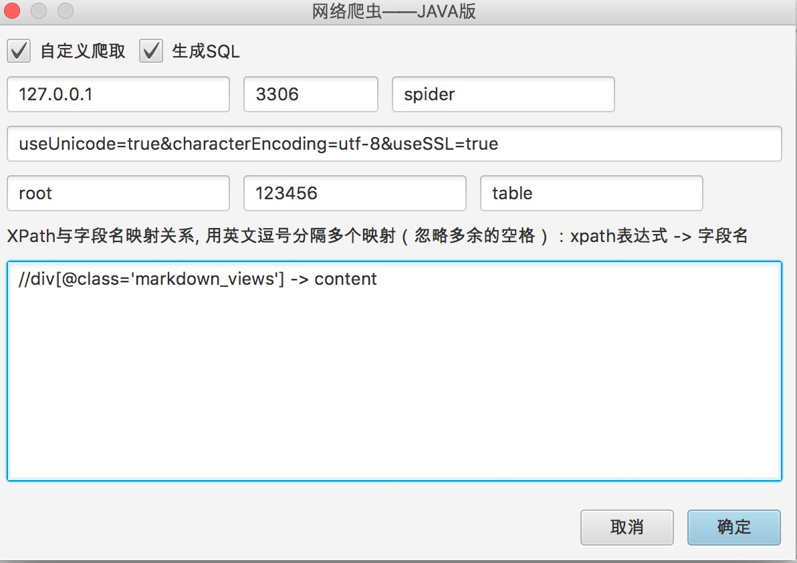
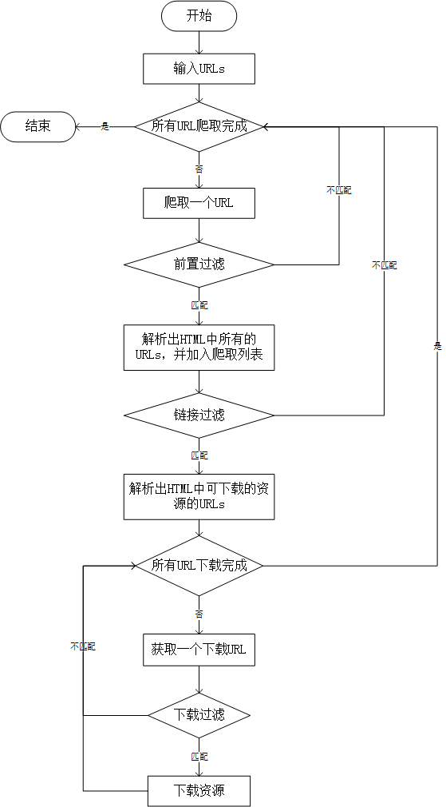

QQ交流群（573484012）

#### 图片爬取

目前支持的图片格式有 bmp，gif，jpeg，png，tiff，pcx，tga，svg，pic

#### 媒体爬取

目前支持的媒体格式有 avi，mov，swf，asf，navi，wmv，3gp，mkv，flv，rmvb，webm，mpg，mp4，qsv，mpeg，mp3，aac，ogg，wav，flac，ape，wma，aif，au，ram，mmf，amr，flac

#### 链接爬取

其实就是下载HTML源代码

#### 文档爬取

目前支持的文档格式有 pdf，docx，txt，log，conf，java，xml，json，css，js，html，hml，php，wps，rtf

#### 其他文件爬取

目前支持的文件格式有 zip，exe，dmg，iso，jar，msi，rar，tmp，xlsx，mdf，com，casm，for，lib，lst，msg，obj，pas，wki，bas，map，bak，dot，bat，sh，rpm

#### 自定义爬取

自定义XPath表达式，将匹配的网页内容存储至MySQL数据库

> [了解XPath语法](http://www.w3school.com.cn/xpath/xpath_syntax.asp)

#### 爬虫工作流程

#### 运行截图

[点我下载](http://oq3iwfipo.bkt.clouddn.com/tools/zhazhapan/visual-spider-1.1.jar)